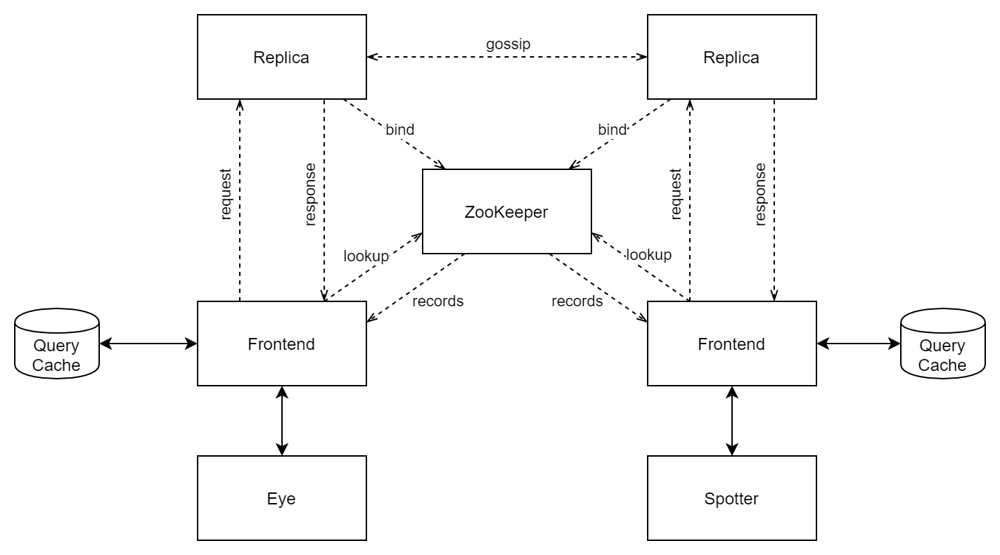
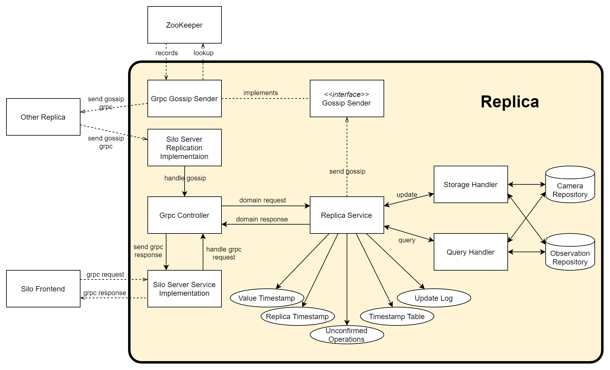

# Relatório do projeto Sauron

Sistemas Distribuídos 2019-2020, segundo semestre

## Autores

**Grupo A16**
 

| Número | Nome              | Utilizador                         | Correio eletrónico                            |
| -------|-------------------|------------------------------------| ----------------------------------------------|
| 89439  | Duarte Alves      | <https://github.com/DuarteMRAlves> | <mailto:duartemalves@tecnico.ulisboa.pt>      |
| 89453  | Guilherme Peixoto | <https://github.com/guilherme-p>   | <mailto:guilherme.peixoto@tecnico.ulisboa.pt> |
| 89492  | Lídia Custódio    | <https://github.com/lidiagc>       | <mailto:lidiagcustodio@tecnico.ulisboa.pt>    |

  

## Melhorias da primeira parte

 * [Pacote de domínio, Interfaces, Exceções no Servidor](https://github.com/tecnico-distsys/A16-Sauron/commit/b30833af887eac6de8ff57dfa34db85b4570086d)
 
 O pacote de domínio passou a conter todas as classes relacionadas com as câmaras e observações, 
 incluindo os seus repositórios, em vez de se encontrarem separadas.
 
 Retiradas as interfaces utilizadas apenas uma vez, de modo a melhorar a legibilidade.

 As exceções deixaram de imprimir os erros quando estes eram provocados por parâmetros incorretos por parte dos clientes.

 * [Interfaces no Spotter](https://github.com/tecnico-distsys/A16-Sauron/commit/781ae496c96a72613f7be297699669adbd1f924c)
 
 Retiradas as interfaces utilizadas apenas uma vez, de modo a melhorar a legibilidade.

 * [Controlador único no Servidor](https://github.com/tecnico-distsys/A16-Sauron/commit/e6d7b47264d087ddd0d0dfe1eb76588cbbd7e535)

 Controlador responsável pela comunicação entre clientes e servidores, e transformação entre grpc e objetos do domínio.
 
 * [Serviço único no Servidor](https://github.com/tecnico-distsys/A16-Sauron/commit/40a6556cafe976519bcabdd6a9743a1c9bf1c361)
 
 Serviço responsável por todos os pedidos (ReplicationService) sendo que as operações de update e query são executadas por handlers.
 

## Modelo de faltas

#### Faltas toleradas

 * Se existirem falhas de comunicação entre réplicas, mas não se gerarem partições no grafo das ligações, 
 todos os servidores irão, eventualmente, sincronizar os seus dados.
 * Se ocorrer uma partição no grafo das ligações entre réplicas, as operações não propagadas a todos os servidores 
 serão guardadas e transmitidas quando a partição for corrigiada.
 * As réplicas respondem sempre aos clientes, segundo o seu estado, de modo a garantir elevada disponibilidade.
 * Se uma réplica falhar, o cliente ligado a essa réplica automaticamente liga-se a outra réplica, se alguma estiver disponível.
 * Quando uma réplica envia um estado anterior ao do cliente, é utilizada uma cache com respostas prévias,
 de modo a que as leituras do cliente sejam coerentes.

#### Faltas não toleradas

 * Se uma réplica falha quando já executou operações que foram apagadas dos logs de todas as réplicas, 
 não consegue voltar a receber as mesmas. Logo, se voltar a iniciar, vai sempre ficar num estado inconsistente.
 * No caso de dois pedidos cuja informação se interseta (como um spot e trail da mesma observação), 
 se o primeiro for enviado a uma réplica mais atualizada, e o segundo a uma réplica desatualizada 
 (visto que a primeira réplica pode falhar), vai existir uma leitura incoerente por parte do cliente.
 * Se duas câmaras se ligarem a duas réplicas, no intervalo entre troca das mensagens gossip, 
 ambas as câmaras são registadas.

## Solução

#### Arquitetura da solução

*Arquitetura da solução*

A solução basea-se numa arquitetura gossip. As réplicas trocam mensagens entre si, de modo a garantir consistência fraca.
Os clientes enviam pedidos para cada servidor através de uma interface frontend. Esta interface guarda uma cache que tenta
manter a consistência entre interrogações a réplicas diferentes.

As réplicas registam-se no servidor de nomes zookeeper de modo a que os clientes as possam descobrir, bem como outros servidores.

#### Arquitetura da réplica

*Arquitetura da réplica*

**Pedidos de atualização e leitura**

Os pedidos são recebidos pelo *Server Service* que os transmite ao *Grpc Controller*.
O controlador transforma as mensagens gRPC em objetos do domínio, e entrega-o ao *Replica Service*. 

No *Replica Service*, o pedido é executado pelo *Storage Handler* ou
*Query Handler* consoante seja uma atualização ou leitura, respetivamente.
Estas classes executam as operações sobre o repositórios, que ficam responsáveis por guardar
os dados e pela sincronização do seu acesso.

O resultado do pedido é retornado ao *Grpc Controller*, que o transforma numa mensagem gRPC e envia ao cliente.

**Mensagens Gossip**

O *Replica Service* envia as atualizações a partilhar com outras réplicas para o *Grpc Gossip Service*
que as transforma em mensagens gRPC e envia para todas as outras réplicas disponíveis,
utilizando o servidor de nomes *ZooKeeper* para as localizar.

As mensagens gossip, de outras réplicas, são recebidas no *Server Replication* e transmitidas ao *Grpc Controller*, que
as transforma em objetos do domínio. As atualizações são novamente enviadas ao *Replica Service* para
serem processadas, sendo eventualmente o estado do servidor atualizado.

## Protocolo de replicação

#### Estruturas de Dados

 * **Vector Timestamp**: Vetor de números positivos com tamanho igual ao número de réplicas.

 * **Value Timestamp**: *Vector Timestamp* onde, para a réplica `i`, o valor da posição `i` representa 
 o número de atualizações recebidas de um frontend, já aplicadas.
 As outras posições, correspondentes a cada réplica, representam o número de atualizações já aplicadas,
 enviadas pela réplica em questão por mensagens gossip.
 
 * **Replica Timestamp**: *Vector Timestamp* onde, para a réplica `i`, a posição `i` do seu vetor representa 
 o número de atualizações recebidas por mensagens de um frontend.
 As outras posições, correspondentes a cada réplica, representam o número de updates de frontends, 
 recebidos nas outras réplicas, e propagados por mensagens gossip.
 
 * **Update Log**: Estrutura com as atualizações por aplicar, que ainda não estam estáveis, ou
 que já foram executadas, mas ainda não foram confirmadas por todas as outras réplicas.
 
 * **Log Entry**: Uma entrada do *log*, que representa uma atualização, contém o identificador da operação, 
 os seus parâmetros, o número da réplica que recebeu o pedido, o timestamp do frontend (`prev`), e o timestamp 
 gerado pelo servidor `i`, substituíndo a entrada `i` do vetor `prev`, pela posição `i` do seu *Replica Timestamp*.
 
 * **Timestamp Table**: Conjunto de todos os replica timestamps de servidores, propagados por mensagens gossip,
 representando as atualizações recebidas por cada servidor.
 
 * **Frontend Timestamp**: *Vector Timestamp* onde cada posição reflete as atualizações já vistas pelo frontend 
 e recebidas pelas réplicas respetivas.
 
 * **Frontend Cache**: Cache com as respostas mais recentes das réplicas aos pedidos do cliente.
 
#### Conteúdo das Mensagens
 
 * **Gossip Message**: 
   * *Replica Timestamp* do servidor que envia a mensagem. 
   * Atualizações (*Log Entries*) que o servidor estima que a réplica de destino ainda não conhece.
 
 * **Query Request**:
   * Dados do pedido.
   * *Vector Timestamp* do frontend (`prev`).
 * **Query Response**:
   * Dados da resposta.
   * Value timestamp da réplica (`new`).
 * **Update request**:
   * Dados do pedido.
   * *Vector Timestamp* do frontend (`prev`).
 * **Update response**:
   * Timestamp da entrada, gerado pelo servidor (`updateID`).
 
#### Execução das Operações

 * **Gossip**:
   * As mensagens gossip são enviadas segundo um intervalo definido, a todas as réplicas possíveis.
   * As atualizações enviadas são estimadas pela réplica a partir do timestamp guardado da réplica de destino.
   Uma atualização é enviada se o seu timestamp não acontecer antes do timestamp guardado.
   * A réplica de destino junta as atualizações recebidas com o seu *log*, apenas acrescentando aquelas
   que não acontecem antes do seu replica timestamp.
   * Esta atualiza a tabela de timestamps com o timestamp recebido e apaga as
   entradas do seu *log* que já foram confirmadas por todas as réplicas. Uma entrada é
   apagada se para todas as réplicas a seguinte condição se verificar:
   a entrada do timestamp da atualização correspondente à réplica que recebeu o pedido deve ser 
   maior ou igual à entrada respetiva do timestamp da réplica em causa.
 * **Query**:
   * Quando a mensagem chega ao servidor, este executa o pedido imediatamente, independentemente do seu estado, retornando o timestamp `new`, bem como os dados pedidos.
   * Caso exista um pedido na cache com um timestamp anterior ao timestamp `new`, o valor na cache é atualizado, sendo o novo valor devolvido ao cliente. 
   * Caso contrário, o novo valor é ignorado, sendo devolvido ao cliente o valor da cache, de modo a manter a coerência de leitura.
   * O frontend faz *merge* do seu vetor `prev` com o vetor `new`.
 * **Update**:
   * Réplica gera o timestamp `updateID` para a atualização e envia-o ao frontend.
   * A atualização é adicionada ao *log* para ser executada quando estiver estável.
   * Para uma atualização ser estável, o seu valor `prev` tem de acontecer antes do
   *Value Timestamp* da réplica. Nesse caso, o servidor executa a operação, atualiza o seu
   *Value Timestamp*, onde cada entrada é o máximo entre as entradas respetivas do *Value Timestamp*
   e do timestamp da operação.
   * O frontend faz *merge* do seu vetor `prev` com o vetor `updateID`.

## Opções de implementação

A cache do frontend foi implementada como uma cache LRU (*Least Recently Used*), com um tamanho máximo fixo. 
Se a cache já tiver todas as entradas preenchidas, ao inserir um novo valor, o valor acedido à mais tempo é retirado.

No servidor, ao receber um pedido de leitura, é devolvido sempre a resposta com o estado atual do servidor, mesmo que desatualizado. 
Desta forma, o pedido é executado de forma assíncrona, no sentido em que o servidor não espera pela atualização do seu estado, 
sendo a consistência fraca garantida pela cache do frontend.

No servidor, existe uma tarefa (*thread*) cuja função é tentar executar atualizações do *Update Log* que já estejam estáveis. 
Deste modo, as atualizações são executadas assincronamente, não bloqueando outros pedidos ao servidor.

O *Update Log* é implementado como uma *Priority Queue* para garantir uma ordem das atualizações pelo seu timestamp vector, evitando uma ordenação por cada inserção no *log*.

Sempre que uma atualização do *Update Log* fica num estado estável e é executada, também é adicionada à estrutura *Unconfirmed Operations Set* 
que guarda todas as atualizações já executadas, mas ainda não confirmadas pelas outras réplicas. 
Uma atualização é removida desta estrutura quando existir confirmação por parte de todas as outras réplicas que a operação foi realizada. 
Enquanto não existir esta confirmação, a réplica envia todas as atualizações no *Unconfirmed Operations Set* nas mensagens Gossip.
